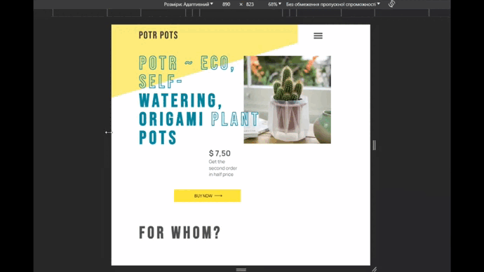
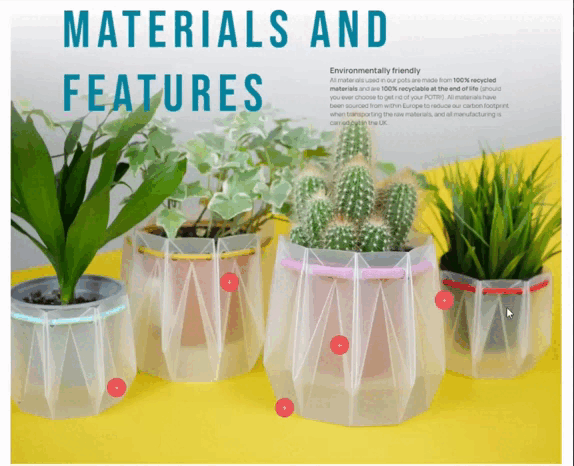
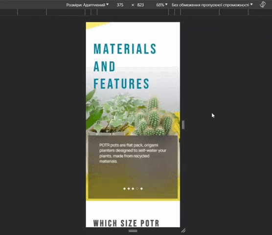
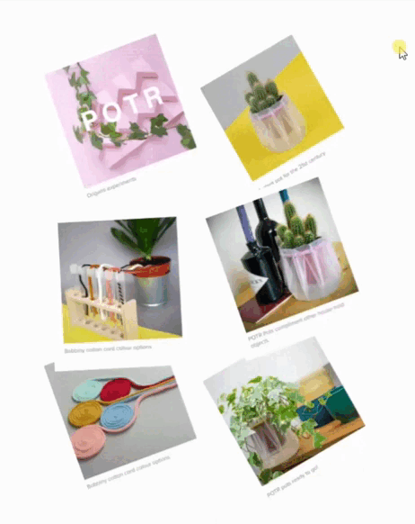

<h1> POTR POTS landing page </h1>

- Created according to [Figma design](https://www.figma.com/file/50zgLU65Mcd3MisFHMfLfx/POTR-POTS_FE-students?type=design&node-id=1760-281&mode=design&t=1gdVcFK39TQ8Zd5s-0)

- [Demo Link](https://valeraviachalo.github.io/potr-pots-landing/)

# Technologies
- HTML
- SCSS
- JavaScript
- Swiper.js
- AOS

## Adaptive
  - Desktop 1280px
  - Tablet 640px
  - Mobile (> 320px)

 

# Features
  - ## Loader and smooth sections appearance
  
  
   

  - ## Response menu
  

  - ## Materials and features section
    - ## Click for details
      
    - ## Swiper for mobile devices
      

  - ## Reviews with hover
    

## How to run
1. Install node v. 14.18.0
2. Open project and run `npm i`
3. Write `npm start`
4. Done
